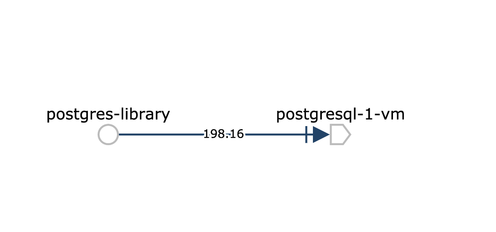
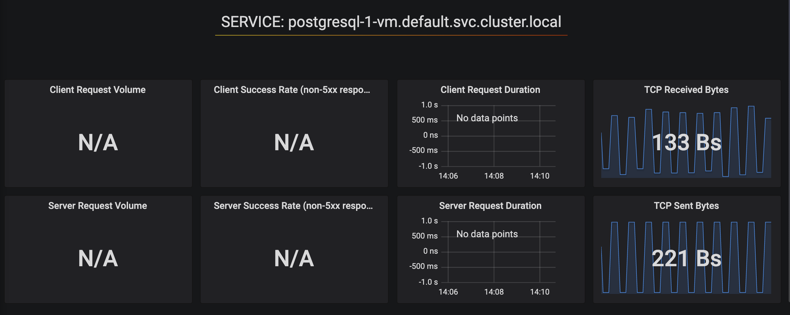

# 📚 postgres-library

This demo walks through the process of installing Istio on a Kubernetes Cluster, then a Virtual Machine. Then, we install PostgreSQL on the VM, and a database client on the cluster. From there, we can see Istio-generated metrics for the client and the database, and use Istio policies to encrpypt all traffic between the client and the VM.


    - [1. Set variables](#1-set-variables)
    - [2. Create a GKE cluster.](#2-create-a-gke-cluster)
    - [3. Install Istio on the cluster.](#3-install-istio-on-the-cluster)
    - [4. Deploy PostgreSQL on a virtual machine.](#4-deploy-postgresql-on-a-virtual-machine)
    - [5. Allow Pod IP traffic to the VM.](#5-allow-pod-ip-traffic-to-the-vm)
    - [6. Prepare a `cluster.env` file to send to the VM.](#6-prepare-a-clusterenv-file-to-send-to-the-vm)
    - [7. Install Istio on the VM.](#7-install-istio-on-the-vm)
    - [8. Register the VM with Istio running on the GKE cluster:](#8-register-the-vm-with-istio-running-on-the-gke-cluster)
    - [9. Create a secret with postgres credentials.](#9-create-a-secret-with-postgres-credentials)
    - [10. Deploy the PostgresSQL client.](#10-deploy-the-postgressql-client)
    - [11. Get application logs to verify that writes are successful.](#11-get-application-logs-to-verify-that-writes-are-successful)
    - [12. View client-side `outbound` Envoy logs, for the postgres client.](#12-view-client-side-outbound-envoy-logs-for-the-postgres-client)
    - [13. View server-side `inbound` Envoy logs.](#13-view-server-side-inbound-envoy-logs)
    - [14. View the Kiali service graph.](#14-view-the-kiali-service-graph)
    - [15. View Grafana metrics in the Istio Service Graph dashboard.](#15-view-grafana-metrics-in-the-istio-service-graph-dashboard)
    - [16. [Optional] Encrypt traffic between the client and postgres using mutual TLS authentication.](#16-optional-encrypt-traffic-between-the-client-and-postgres-using-mutual-tls-authentication)

### 1. Set variables

```
PROJECT_ID=<your project ID>

ZONE="us-east1-b"
VM_ZONE="us-central1-c"
CLUSTER_NAME="istio"
ISTIO_VERSION="1.3.4"
CTX="gke_${PROJECT_ID}_${ZONE}_${CLUSTER_NAME}"

SERVICE_NAMESPACE="default"
PORT="5432"
VM_NAME="postgresql-1-vm"
SVC_NAME=$VM_NAME
```

###  2. Create a GKE cluster.

```
gcloud config set project $PROJECT_ID

gcloud container clusters create $CLUSTER_NAME --zone $ZONE --username "admin" \
--machine-type "n1-standard-4" --image-type "COS" --disk-size "100" \
--num-nodes "4" --network "default" --enable-cloud-logging --enable-cloud-monitoring --enable-ip-alias --no-enable-autoupgrade
```

Wait for the cluster to be ready, then:

```
gcloud container clusters get-credentials $CLUSTER_NAME --zone $ZONE
kubectl config use-context $CTX
```

### 3. Install Istio on the cluster.

Enable Envoy access logs, to write all inbound and outbound requests to `stdout`.

```
ISTIO_VERSION="1.3.4"  ./install-istio.sh
helm template istio-${ISTIO_VERSION}/install/kubernetes/helm/istio --namespace=istio-system -x templates/configmap.yaml --set global.proxy.accessLogFile="/dev/stdout" | kubectl replace -f -
```

### 4. Deploy PostgreSQL on a virtual machine.

For instance, use the Google Cloud Marketplace to deploy a single postgres instance to Google Compute Engine. Ensure you check the option to allow TCP traffic into port `5432`.

### 5. Allow Pod IP traffic to the VM.

```
K8S_POD_CIDR=$(gcloud container clusters describe ${CLUSTER_NAME?} --zone ${ZONE?} --format=json | jq -r '.clusterIpv4Cidr')

gcloud compute firewall-rules create k8s-to-$VM_NAME \
--description="postgresql" \
--source-ranges=$K8S_POD_CIDR \
--target-tags=${SVC_NAME} \
--action=ALLOW \
--rules=tcp:${PORT}
```

### 6. Prepare a `cluster.env` file to send to the VM.
```
mkdir -p $SVC_NAME
export GWIP=$(kubectl get -n istio-system service istio-ingressgateway -o jsonpath='{.status.loadBalancer.ingress[0].ip}')

ISTIO_SERVICE_CIDR=$(gcloud container clusters describe $CLUSTER_NAME --zone $ZONE --project $PROJECT_ID --format "value(servicesIpv4Cidr)")
echo -e "ISTIO_CP_AUTH=MUTUAL_TLS\nISTIO_SERVICE_CIDR=$ISTIO_SERVICE_CIDR\n" > ${SVC_NAME}/cluster.env

echo "ISTIO_INBOUND_PORTS=${PORT}" >> ${SVC_NAME}/cluster.env

kubectl -n $SERVICE_NAMESPACE get secret istio.default  \
-o jsonpath='{.data.root-cert\.pem}' |base64 --decode > ${SVC_NAME}/root-cert.pem
kubectl -n $SERVICE_NAMESPACE get secret istio.default  \
-o jsonpath='{.data.key\.pem}' |base64 --decode > ${SVC_NAME}/key.pem
kubectl -n $SERVICE_NAMESPACE get secret istio.default  \
-o jsonpath='{.data.cert-chain\.pem}' |base64 --decode > ${SVC_NAME}/cert-chain.pem


gcloud compute scp --project=${PROJECT_ID} --zone=${VM_ZONE} {${SVC_NAME}/key.pem,${SVC_NAME}/cert-chain.pem,${SVC_NAME}/cluster.env,${SVC_NAME}/root-cert.pem} "${VM_NAME}":~
```

### 7. Install Istio on the VM.

First, get the Istio IngressGateway `EXTERNAL_IP`. The Istio components running on the VM will route requests to the Istio control plane (Pilot, Citadel) through the publicly-accessible IngressGateway, since these components are not exposed outside the cluster.

```
kubectl get svc -n istio-system istio-ingressgateway
```

Then, SSH into the VM running Postgres:

```
gcloud compute ssh --project=${PROJECT_ID} --zone=${VM_ZONE} "${VM_NAME}"
export ISTIO_VERSION="1.3.4"
export GWIP=<ingress IP>
```

Download Istio proxy and Node Agent:

```
curl -L https://storage.googleapis.com/istio-release/releases/${ISTIO_VERSION}/deb/istio-sidecar.deb > istio-sidecar.deb
sudo dpkg -i istio-sidecar.deb
echo "${GWIP} istio-citadel istio-pilot istio-pilot.istio-system" | sudo tee -a /etc/hosts
sudo mkdir -p /etc/certs
sudo cp {root-cert.pem,cert-chain.pem,key.pem} /etc/certs
sudo cp cluster.env /var/lib/istio/envoy
sudo chown -R istio-proxy /etc/certs /var/lib/istio/envoy
```

Verify that the VM can perform a CSR signing request, for its token:

```
sudo node_agent
```

Run Istio:

```
sudo systemctl start istio-auth-node-agent
sudo systemctl start istio
```

### 8. Register the VM with Istio running on the GKE cluster:

```

export GCE_IP=$(gcloud --format="value(networkInterfaces[0].networkIP)" compute instances describe "${VM_NAME}" --zone=${VM_ZONE})

kubectl -n ${SERVICE_NAMESPACE} apply -f - <<EOF
apiVersion: networking.istio.io/v1alpha3
kind: ServiceEntry
metadata:
  name: ${SVC_NAME}
spec:
  hosts:
  - ${SVC_NAME}.${SERVICE_NAMESPACE}.svc.cluster.local
  ports:
  - number: ${PORT}
    name: tcp
    protocol: TCP
  resolution: STATIC
  endpoints:
  - address: ${GCE_IP}
    ports:
      tcp: ${PORT}
    labels:
      app: ${SVC_NAME}
EOF

istioctl register -n ${SERVICE_NAMESPACE} ${SVC_NAME} ${GCE_IP} tcp:${PORT}
```

### 9. Create a secret with postgres credentials.

```
kubectl create secret generic postgres --from-literal=password="<your-postgres-password>"
```

### 10.  Deploy the PostgresSQL client.

This client writes a book title to the database every two seconds.

```
kubectl apply -f manifests/k8s.yaml
```

### 11. Get application logs to verify that writes are successful.

You should see:

```
postgres-library-6bb956f86b-dt94x server ✅ inserted Fun Home
postgres-library-6bb956f86b-dt94x server ✅ inserted Infinite Jest
postgres-library-6bb956f86b-dt94x server ✅ inserted To the Lighthouse
```

### 12. View client-side `outbound` Envoy logs, for the postgres client.

You should see outbound requests going to the VM:

```
postgres-library-6bb956f86b-dt94x istio-proxy [2019-11-14T19:07:00.106Z] "- - -" 0 - "-" "-" 260 441 258 - "-" "-" "-" "-" "10.128.0.14:5432" outbound|5432||postgresql-1-vm.default.svc.cluster.local 10.24.2.23:39540 10.0.24.255:5432 10.24.2.23:51654 - -
```

Note that the `10.128.0.14` IP address, in this case, corresponds to the IP of the Virtual Machine, resolved through the Kubernetes Service Cluster IP (`10.0.24.255`) that was created when we ran `istioctl register`.

### 13. View server-side `inbound` Envoy logs.

This is for the Envoy sitting in front of the database, on the VM. You must ssh into the VM to see the logs.

```
tail -f /var/log/istio/istio.log
```

You should see:

```
[2019-11-14T19:09:00.174Z] "- - -" 0 - "-" "-" 268 441 194 - "-" "-" "-" "-" "127.0.0.1:5432" inbound|5432|tcp|postgresql-1-vm.default.svc.cluster.local 127.0.0.1:54104 10.128.0.14:5432 10.24.2.23:40190 outbound_.5432_._.postgresql-1-vm.default.svc.cluster.local -
```

Here, `10.24.2.23` corresponds to the client pod running in the cluster.

### 14. View the Kiali service graph.



### 15. View Grafana metrics in the Istio Service Graph dashboard.

Run `istioctl dashboard grafana`:



Note that the spiky TCP traffic pattern corresponds to the write the client performs every two seconds.

### 16. [Optional] Encrypt traffic between the client and postgres using mutual TLS authentication.

```
kubectl apply -f manifests/mtls.yaml
```